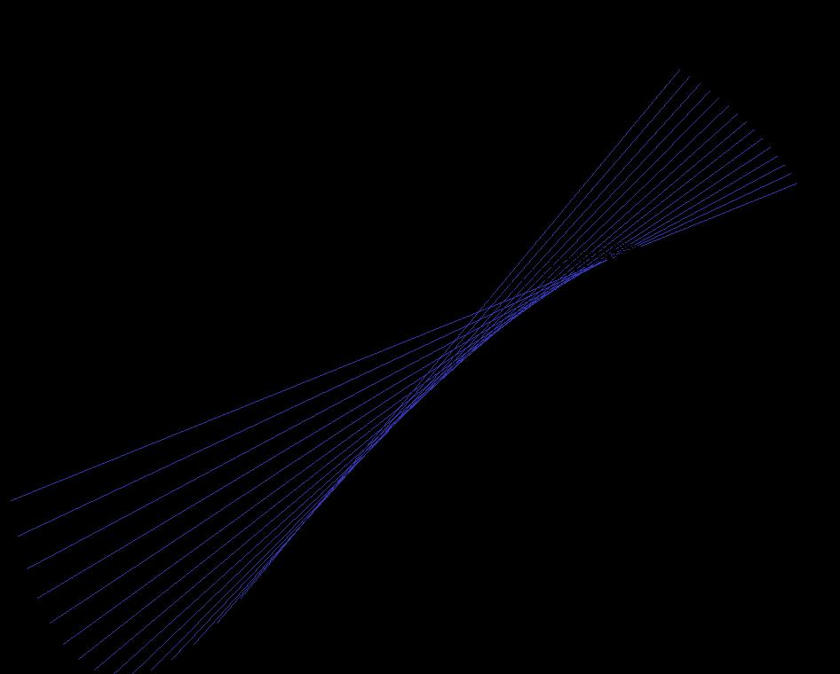



## Sine Line Screen Saver

### Description

This is a very well written and fully functional screen saver, compatible with windows 98 and up. It draws moving lines based on Sine functions (very hypnotic). There are no edge detects. The publicly posted open source core of this code was written by:

Rod Stephens (Core functionality)

Neil Fraser (Integration &amp; Win 98 multi-monitors)

Elliot Spencer (Win 9x locking &amp; registry lookup)

Don Bradner &amp; Jim Deutch (Password handling)

Lucian Wischik &amp; Alex Millman (NT information)

I created and added all the graphics and motion control code.
 
### More Info
 

             |
---                |---
**Submitted On**   |2009-01-31 10:18:20
**By**             |[0x34](https://github.com/Planet-Source-Code/PSCIndex/blob/master/ByAuthor/0x34.md)
**Level**          |Intermediate
**User Rating**    |5.0 (15 globes from 3 users)
**Compatibility**  |VB 6\.0
**Category**       |[Windows System Services](https://github.com/Planet-Source-Code/PSCIndex/blob/master/ByCategory/windows-system-services__1-35.md)
**World**          |[Visual Basic](https://github.com/Planet-Source-Code/PSCIndex/blob/master/ByWorld/visual-basic.md)
**Archive File**   |[Sine\_Line\_2142291312009\.zip](https://github.com/Planet-Source-Code/0x34-sine-line-screen-saver__1-71702/archive/master.zip)

